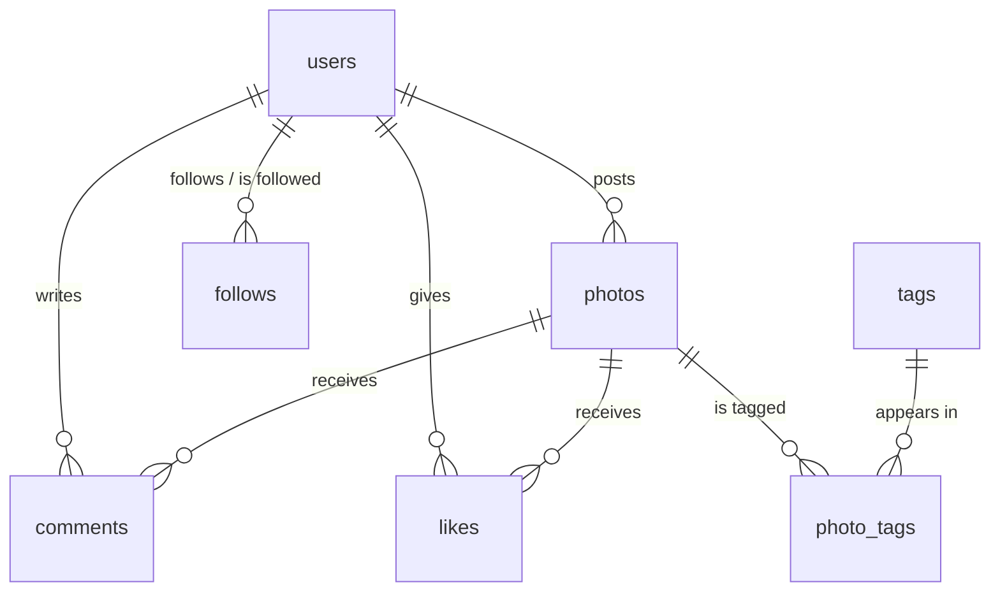

# Instagram Clone — SQL Analytics


Analytics on a realistic **Instagram-style relational database**: a 7-table MySQL schema (users, photos, likes, comments, follows, hashtags) seeded with sample data, queried to answer product-style questions about user behavior and engagement.

## Database schema

`ig_clone_data.sql` creates the `ig_clone` database and loads the seed data:



- `users` — accounts with unique usernames and signup timestamps
- `photos` — image posts, FK to the posting user
- `comments`, `likes` — engagement, both FK'd to user + photo (`likes` uses a composite PK to prevent double-liking)
- `follows` — self-referencing many-to-many on users (follower → followee)
- `tags` + `photo_tags` — hashtags and their many-to-many link to photos

## Questions answered

| # | Business question | SQL concepts |
|---|---|---|
| 1 | Who are the 5 oldest (earliest-registered) users? | `ORDER BY` + `LIMIT` |
| 2 | Which two days of the week get the most registrations? | `DAYNAME()`, `GROUP BY`, ranking |
| 3 | Which users have never uploaded a photo? | `LEFT JOIN ... IS NULL` / anti-join |
| 4 | Which photo has the most likes (and who posted it)? | multi-table joins + aggregation |
| 5 | What's the average number of photos per user? | subqueries over aggregates |
| 6 | What are the top 5 most-used hashtags? | join through a junction table |
| 7 | Which users liked every single photo (bot detection)? | `HAVING COUNT(*) = (SELECT COUNT(*) ...)` |

Full worked answers (queries + result tables + commentary) are in [`IG_Clone.pdf`](IG_Clone.pdf) / [`IG_Clone.docx`](IG_Clone.docx). Question 7 is the classic **bot-detection** query — a real account almost never likes literally everything.

## Getting started

```bash
git clone https://github.com/adityashroff06-code/IG_Clone_SQL_Assignment.git
cd IG_Clone_SQL_Assignment

# load schema + seed data (drops any existing ig_clone database!)
mysql -u root -p < ig_clone_data.sql

mysql -u root -p ig_clone
```

Then run the queries from the report — for example, the bot check:

```sql
SELECT u.username, COUNT(*) AS total_likes
FROM users u
JOIN likes l ON u.id = l.user_id
GROUP BY u.id
HAVING total_likes = (SELECT COUNT(*) FROM photos);
```

## Project structure

```
├── ig_clone_data.sql   # Schema (7 tables) + seed data
├── IG_Clone.pdf        # Worked answers with queries and results
├── IG_Clone.docx       # Same report, editable source
└── README.md
```

## License

Released under the [MIT License](LICENSE).

## Author

**Aditya Shroff** — [GitHub](https://github.com/adityashroff06-code) · [LinkedIn](https://www.linkedin.com/in/aditya-shroff-8033a31b0)
